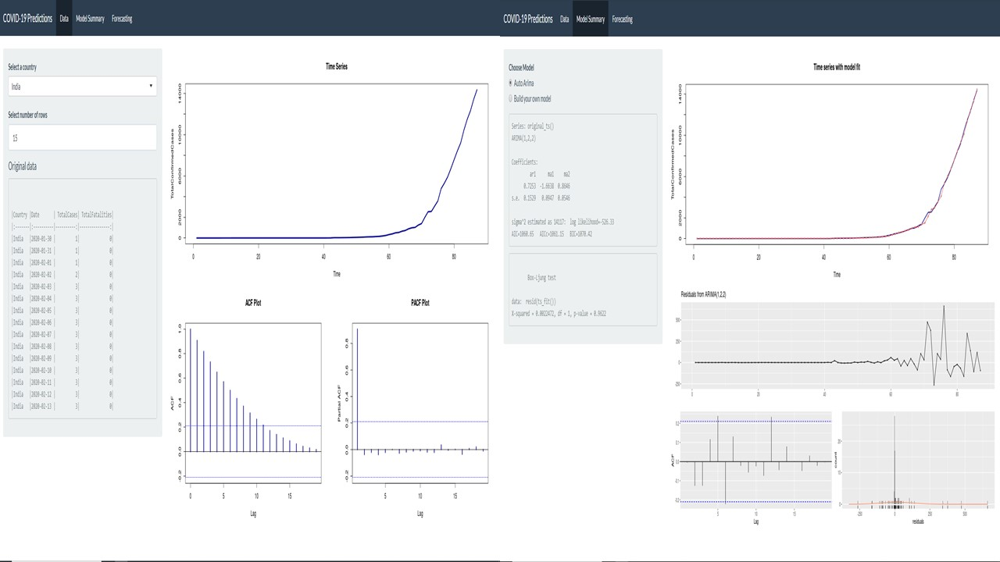
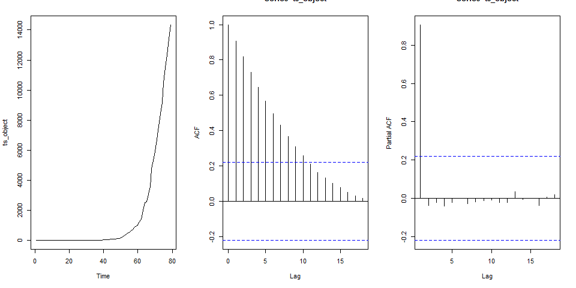
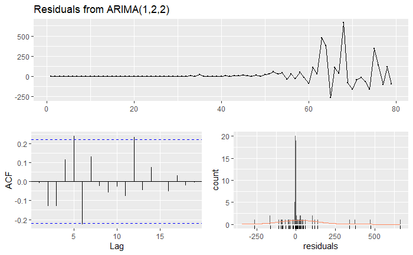
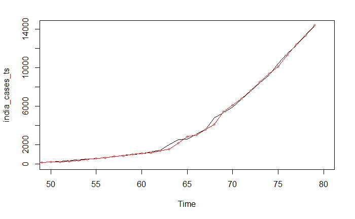
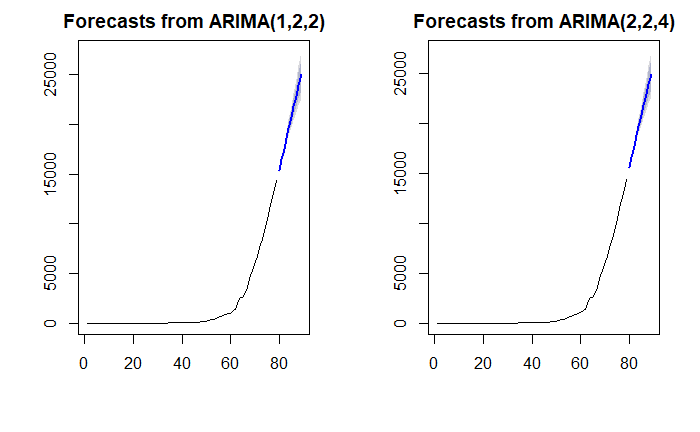
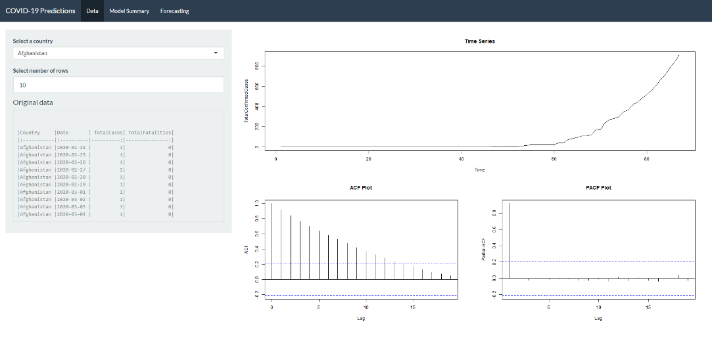
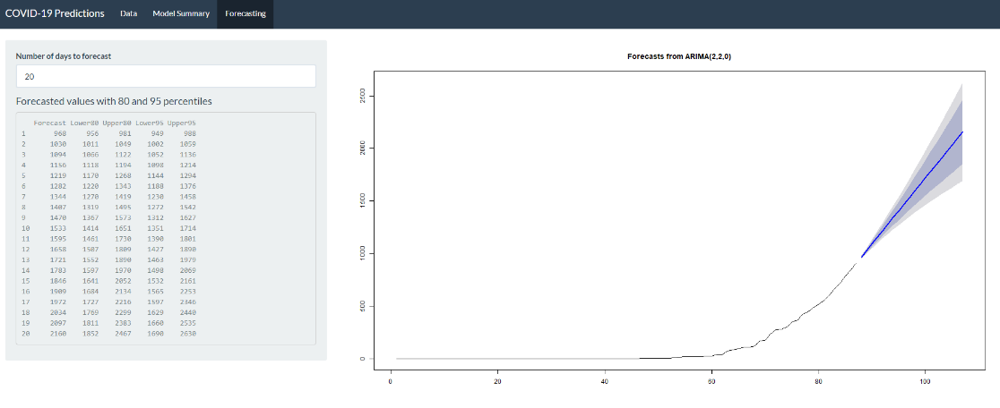

**Introduction**

The world has recently been affected by the pandemic, Covid-19 that has
currently grown to more than 3 million cases in the world. The growth
rate has been exponential. Different countries have handled the outbreak
in different ways, with varying degrees of success.

A recent on-going Kaggle competition provides the data and the incentive
to competitors around the world to predict the pattern of the disease
and the course taken by different countries. The aim is to answer
certain key questions regarding the disease and identifying underlying
trends.

The time-series data was used in this project to model and forecast the
total \# of cases into the future. The main aim was to design a model
for the time-series data and forecast the number for the future. Data
was chosen was a single country, India, for this purpose. A R-Shiny
dashboard was designed and built to scale the models to all the
countries. This provides the flexibility to the user to select a country
and create a model of their choice to achieve a forecast.

The RShiny dashboard that was built could be found [here](https://meenal-narsinghani.shinyapps.io/shiny_application/). Below is a small snapshot of the same.

**Data**

While the data was provided as part of the Kaggle competition, the
original data source is from the John Hopkins database. The key columns
in the dataset include the following information.

-   Province and Country -- To identify the country, and in a few cases
    the province

-   Date -- Daily date for when the observation was recorded

-   Confirmed Cases and Fatalities -- Total confirmed cases and
    fatalities on that date

**Approach**

Data was taken for India, and the preliminary plots were visualized.
Data was from 30^th^ January to 17^th^ April and contains about 79 data
points. This was converted into a time-series data object. It is not
surprising to see that there is an increasing trend in the data. Post
the initial few days, the number of cases has risen exponentially (which
already suggests non-stationarity). The augmented Dickey Fuller test
results in a p-value of 0.99, and this implies non-stationarity (failed
to reject H0).

By intuition, there cannot be a seasonal component as now (and hopefully
will not be in the future!). The ACF suggests slow decay, giving way to
a necessity of an ARIMA component, including perhaps a difference
operator.

A differencing of the first order suggests that the mean looks
relatively stable. There might be non-constant variance but the ADF test
results in a p-value of 0.01, which is satisfactory. We could conclude
that the data is relatively stationary. This makes the order d = 2.

The new dataset was created with the difference, and once again plotted
to visualize the ACF and PACF plots. These provide certain guidelines on
the order of p and q, based on which a model could be fit on the
dataset.

*Figure 1 - Plot for original time-series*

To build the model, the auto.arima() function suggests an ARIMA(0,0,4)
with a non-zero mean on the differenced dataset. The same function
returns an ARIMA(1,2,2) on the original time series. Below is the plot,
acf and pacf of the time series with diff 2.

The ACF suggests that there is a moving average component of at least
till q = 1. The PACF plot suggests that there is an AR component till
perhaps p = 3. The auto.arima results support this, suggesting that a
ARIMA(1,2,2) model might be appropriate.

*Figure 2- Plot for time-series with diff(2)*

Based on these intuitions and preliminary data results, the modeling
process is conducted.

**Model Building and Comparison**

Based on the results of the ACF and PACF plots, multiple iterations of
the ARIMA model were run. The main criteria for comparison were the AIC
values (lower value is better), Box-Ljung test (with lag = 10) for residual analysis and
the forecast value itself to get a check how different the values are.
Below is a simple comparison of the same.

| Model         | AIC   | df    | p-value   | Result         |
|:-------------:|:-----:| -----:|:---------:|:--------------:|
| ARIMA(1,2,2)  | 969.4 | 7     | 0.052     | No lack of fit |
| ARIMA(2,2,2)  | 966.7 | 6     | 0.015     | Lack of fit    |
| ARIMA(0,2,4)  | 965.6 | 6     | 0.013     | Lack of fit    |
| ARIMA(1,2,0)  | 993.2 | 9     | \<0.01    | Lack of fit    |
| ARIMA(2,2,4)  | 954.3 | 4     | 0.06      | No lack of fit |
| ARIMA(4,2,4)  | 961.5 | 2     | 0.004     | Lack of fit    |

*Table 1 - Model diagnostics comparison*

The model diagnostics involved checking the residual plots for
normality, the ACF of the residuals and the histogram of the residuals
(to check for normality).

To recap, the Box-Ljung test was used to calculate if the model presents
with a lack of fit.

-   H0 -- The model does not exhibit a lack of fit

-   H1 -- The model exhibits a lack of fit

It is noticed that the ARIMA(2,2,4) presents with the best AIC value,
while only ARIMA(1,2,2) and ARIMA(2,2,4) has a high p-value for a
Box-Ljung test with lag = 10. These two models will be examined a little
more closely to see which presents with the better fit.

*Figure 3 - Residuals from ARIMA(1,2,2)*

*Figure 4 - Residuals from ARIMA(2,2,4)*

The time plot shows some variation in the data. The histogram for the
residuals suggest normality in both the cases (better for ARIMA(2,2,4)
model). The auto-correlation plots show a couple of significant spikes
at certain lags for both the models. The auto-correlation is not large
and the residuals provides a favorable Box-Ljung test result. The
residuals appear to be random. In fact, only the only model with
ACF(residuals) within limit was the ARIMA(4,2,4), but the Box-Ljung test
suggested a lack of fit.

The fitted values show approximately similar results for both the
models. The ARIMA(2,2,4) model seems to fit the time series better
around the 65-70 data index range. A t-test was used to test the
significance of the coefficients for both the models using the
coefficient and the standard error of the coefficient. Both the models
have coefficient p-values that are \< 0.05, suggesting significance.

*Figure 5 - Forecast from ARIMA(1,2,2)*

*Figure* *6 - Forecast from ARIMA(2,2,4)*

**Forecast and comparison**

The forecasts look to follow the same trend, with pretty similar results
for the next 10 days as is shown in the plot below. This was calculated
for immediate next 10 days.

*Figure 7 - Forecasts from both models for 10 days*

The recent data for the past 10 days (sourced directly from Google
tracker) were selected for a general comparison of how the model
performs. While the first few forecast values fall close to the actual
Total Number of Cases, as the days progress, the forecast starts
deviating, up to 15% deviation after 10 days. It also looks the like the
actual number of cases have double in 10 days, while the model forecasts
are lower. This suggests that the growth rate of the disease is
increasing.

|  Date       | ARIMA(1,2,2) |  ARIMA(2,2,4) |  Actual |  Diff ARIMA(1,2,2) |  Diff ARIMA(2,2,4)|
|:-----------:|:------------:|:-------------:|:-------:|:------------------:|:-----------------:|
|  4/18/2020  | 15398        |  15621        |  15712  |  2%                |  1%               |
|  4/19/2020  | 16452        |  16568        |  17265  |  5%                |  4%               |
|  4/20/2020  | 17512        |  17686        |  18600  |  6%                |  5%               |
|  4/21/2020  | 18577        |  18758        |  19984  |  7%                |  6%               |
|  4/22/2020  | 19645        |  19751        |  21393  |  8%                |  8%               |
|  4/23/2020  | 20715        |  20778        |  23077  |  10%               |  10%              |
|  4/24/2020  | 21787        |  21841        |  24506  |  11%               |  11%              |
|  4/25/2020  | 22859        |  22881        |  26496  |  14%               |  14%              |
|  4/26/2020  | 23933        |  23906        |  27892  |  14%               |  14%              |
|  4/27/2020  | 25008        |  24945        |  29435  |  15%               |  15%              |

*Table 2 - Comparison of model forecast vs actual data*

**R Shiny Application**

To perform a similar analysis as of that taken for one country, India,
the team built an interactive R-Shiny dashboard that provides insight
into the time-series and modelling flexibility. The functionality of the
app is as explained below -

**Data Tab**

This tab helps us understand the original data in detail. There are 2
filters in this tab:

-   *'Select a country'* -- To choose the country for the COVID 19
    forecasts (*Default*: Afghanistan)

-   *'Select number of rows'* -- To choose the number of rows of raw
    data to be displayed. This will help in viewing cases and fatalities
    for a country at a date level. (*Default*: 10)

There are 3 plots in addition to the display of raw data in this tab.
The first plot shows the data as a time series object for us to
understand the pattern in data. The ACF and the PACF plots are displayed
below to understand the lag auto-correlations. These plots also help in
building our own model in the next tab where we have an option to build
our own model.

**Model Summary Tab**

This tab has an option to either go with the model from the auto.arima
function or to build a model by specifying the values of p, d, and q.
Auto.arima is chosen to be the default option as this will give a
starting reference for further adjustments. The default value for
building the model is (0,0,0) and the model will not accept any negative
values as input for the values of p, d, and q. Once we make the required
choices, the model summary and the results of the Box-Ljung test are
displayed in the side panel. The former will provide the coefficients of
the AR and MA parts of the model and the latter will check for
autocorrelation in the time series residuals.

In addition to this, the residual plots are displayed for diagnostics to
check if residuals are uncorrelated, is stationary and are normally
distributed. The model fit values are plotted with the data for a
comparison of how well the model performs.

**Forecast Tab**

This tab focusses on generating forecasts from the model built. There is
an input field to enter the number of days into future that we want to
forecast and based on this, the forecast is generated along with the 80%
and 95% confidence bands. One can notice how the width of the band
increases when the days of forecast to be included increases.

In addition to this plot, we also have a table in the side panel which
shows the values of the forecasts along with the values for upper and
lower bands for 80% and 95% confidence. The minimum number of days to
look at the forecast is set to 0 and the maximum number is set to 30.

**Conclusion**

The results of the exercise conclude that an ARIMA(2,2,4) model fits
well with the data of total number of cases for India. The model
predicts the increase in the total number of cases over days. This
increasing trend suggests the path of the disease if no remedial
measures are undertaken, suggesting the consequences of the inaction. As
more and more data are added, one could compare how the model performs
and how the growth rate varies.

The scalable R-Shiny application serves as a good reference and starting
point to building comprehensive models for other countries. While better
models might be fit and better diagnostics may be performed, the
dashboard allows for a quick starting point and if not, a simple model
that serves the purpose.

One could improve the models and the forecasts by choosing other
measures of making a model stationarity (like log transform, moving
average) and with advanced modelling approaches (ARIMA with other
predictors).

**Appendix -- R-Shiny Application Screenshots**

**Data Tab**

**Model Summary Tab**

**Forecast Tab**

